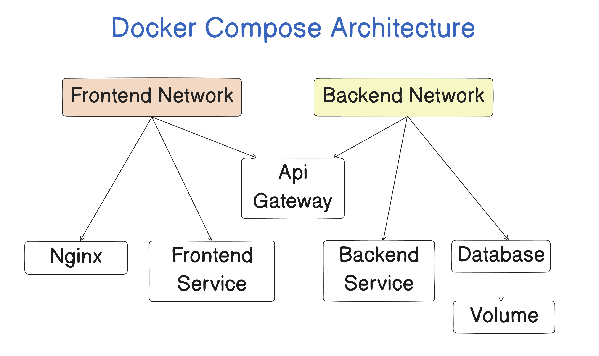
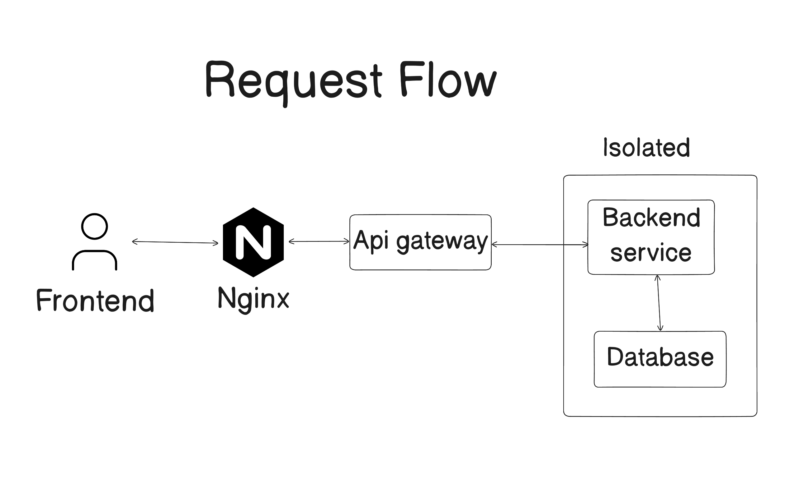

# Containerized Microservices Application

This project demonstrates how to containerize and orchestrate a microservices-based application using Docker and Docker Compose.

## Services

The application consists of the following services:

* **Nginx** — Reverse proxy and entry point for incoming requests
* **Frontend** — Client application
* **API** — Acts as an intermediary service between the frontend and backend
* **Backend** — Handles business logic and database operations
* **PostgreSQL** — Database for persistent data storage

> **Note:** The API service was primarily added for learning purposes to experiment with a multi-service architecture.

## Docker Compose Architecture



The services are isolated using separate Docker networks to control communication between containers.

## Request Flow



The request flow is:

```text
Client
  ↓
Nginx
  ├── /      → Frontend
  │
  └── /api/* → API
                 ↓
               Backend
                 ↓
              PostgreSQL
```

Nginx is the only service exposed to the host machine. All other services communicate internally through Docker networks.

## How to Run

### Prerequisites

Make sure Docker and Docker Compose are installed on your machine.

### Clone the repository

```bash
git clone https://github.com/abdul-ghaffar01/microservices-docker-lab.git
```

### Navigate to the Docker Compose directory

```bash
cd microservices-docker-lab/docker-compose
```

### Start the application

```bash
docker compose up -d --build
```

## Verify the Setup

### Check running containers

```bash
docker ps
```

### Check Docker networks

```bash
docker network ls
```

You should see the networks created for the application.

### Check service logs

```bash
docker compose logs
```
> **Visit**: http://localhost:8080 

To follow logs in real time:

```bash
docker compose logs -f
```

## Stop the Application

```bash
docker compose down
```

To also remove volumes:

```bash
docker compose down -v
```
